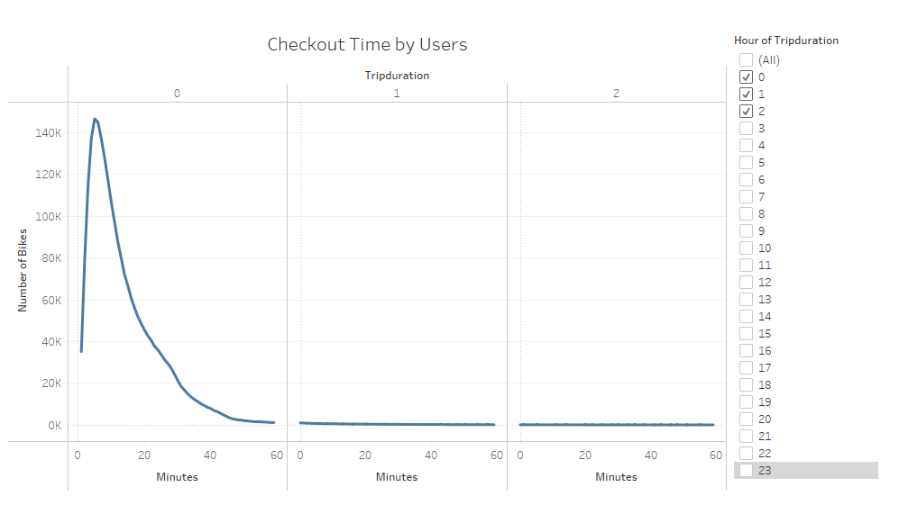
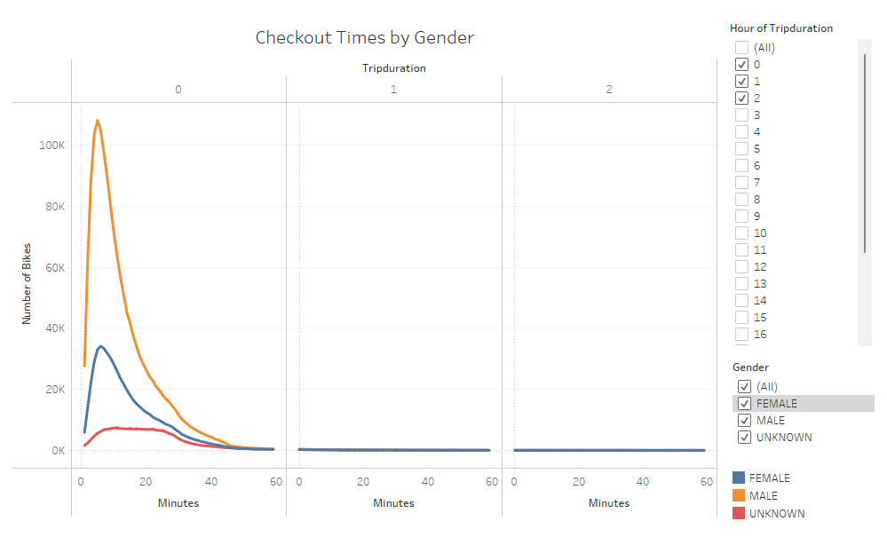
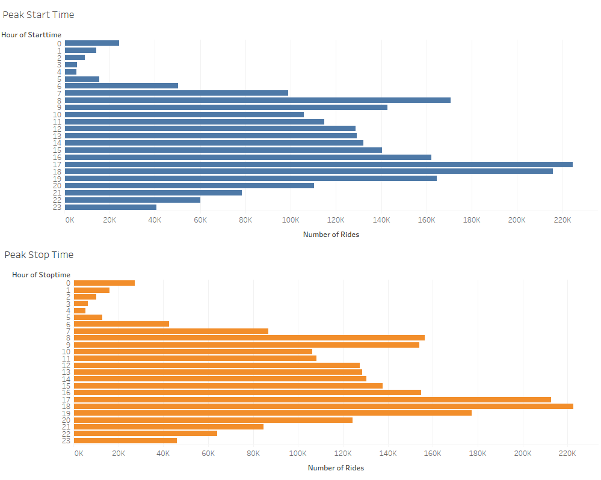
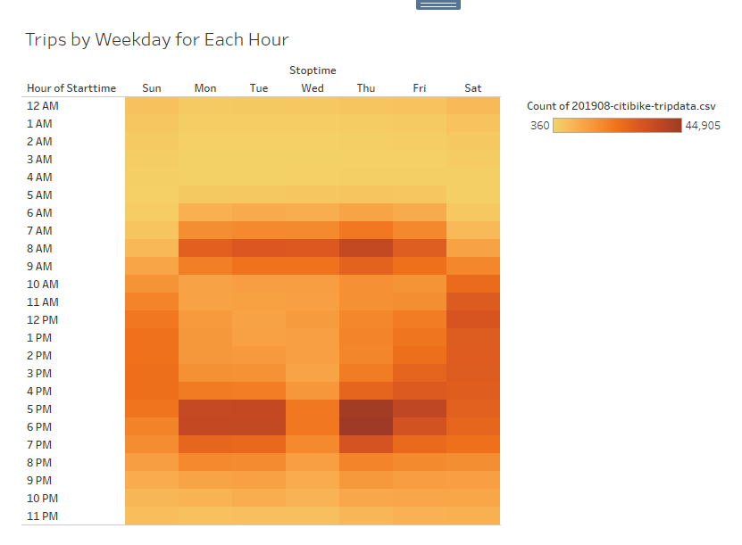
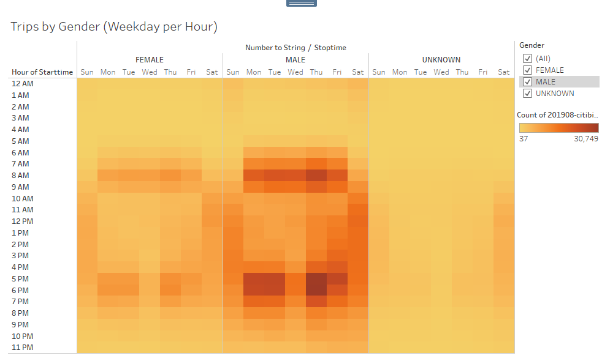
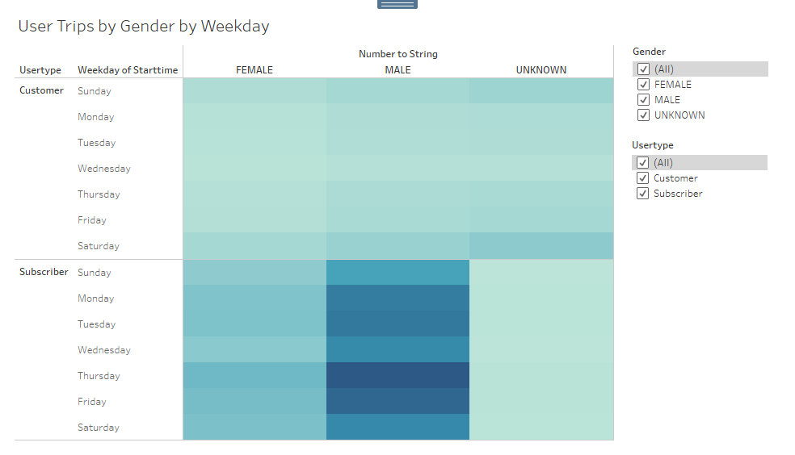

# bikesharing

## Overview
This project is to convince the investors for the bike-sharing program is indeed a potential solid business in Des Moines. For the proposal, we create visualizations of the analysis for NYC CitiBike data through Tableau to show the following: 

- The length of time that bikes are checked out for all riders and genders.
- The number of bike trips for all riders and genders for each hour of each day of the week.
- The number of bike trips for each type of user and gender for each day of the week.
- Top locations of all riders.

[Link to Dashboard](https://public.tableau.com/views/BikesharingChallenge_16490499541810/BikesharingChallenge?:language=en-US&publish=yes&:display_count=n&:origin=viz_share_link)

## Overview

Based on the graph above, we can see that the average duration of bike rides is less than 1 hour and it is almost no one ride bikes for more than 1 hour in NYC. The main reason can be people might only use the Citibike as alternative of taking cab services given New York City is urban city and there are also public transportations available. 

This graph showed that majority of the bike rider are male and the duration of rides between gender is still less than 1 hour.

These two graphs clearly showed the peak hours of CitiBike usages are in the morning between 7am - 9am and in the afternoon between 5pm - 7pm.

This heatmap showed that more people use CitiBike during rush hours during weekdays in the morning between 7am - 9am and  in the afternoon between 5pm - 7pm. These usually are the times when people commute to and from work/school. The map also suggested that the usage of CitiBike over the weekend is higher in the afternon during weekends. 

Similar to the previous graphs of checkout time by gender and trips by weekday, this image has showed again that male riders are the major user of the CitiBike and there are higher numbers of bike usage during the rush hours during weekdays and in the afternoon on the weekends. 

Here we compare the number of rides between CitiBike subscribers and normal customers. This chart again has proven the data from our previous graphs that the major users of the CitiBike are male regardless the day of the week. From the chart, we also can see that the major users of CitiBike are the subscribers, which proved that there is a consistent growth to continue this business. 

The popular locations for the CitiBike usage are mainly in Manhattan, especially in lower Manhattan areas. This suggests that people mainly use the CitiBike for commute as traffics tend to be heavy in these areas and riding bikes can help people to reduce the commute time. 
